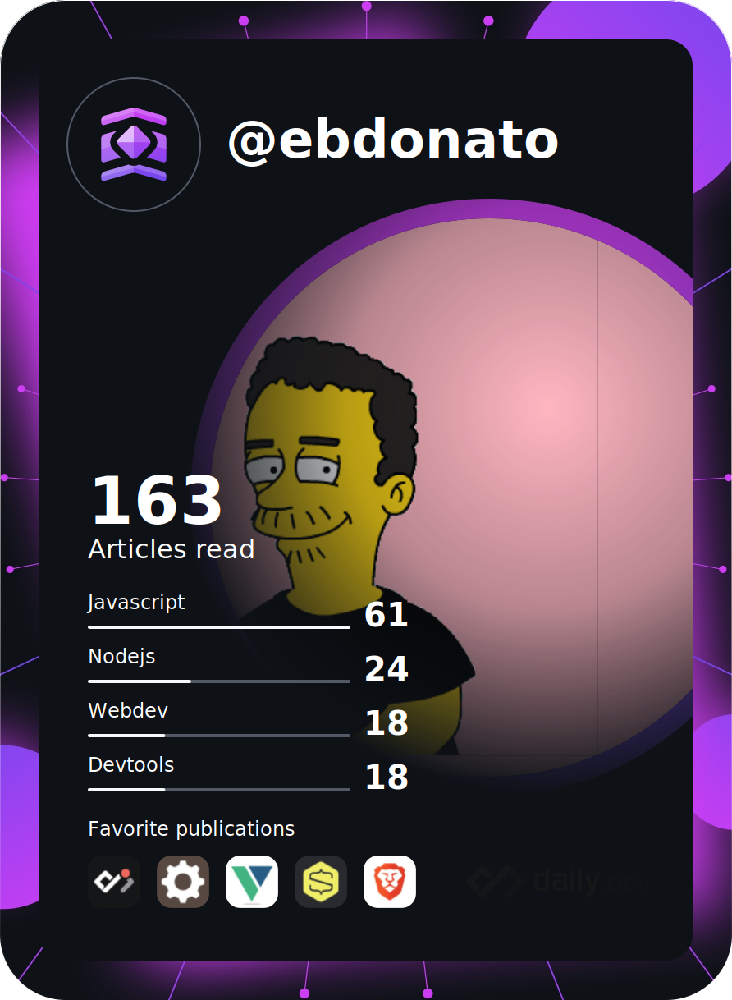

<p>
    <h1 align="center">
        <b>
            👋 Oie, I'm Eduardo Donato
        </b>
    </h1>
</p>

[](https://pimp-my-readme.webapp.io)

<p align="center">
    <small>
        Full Stack Developer (Vue.js and Node.js) and Microsoft Power Platform Developer (Power BI, Power Apps and Power Automate)
    </small>
</p>

<br/>

<p>
    <h2 align="center">
        <b>
            🙍‍♂️ About me
        </b>
    </h2>
</p>

I am an Electrical Engineer graduated from the Universidade Federal de Viçosa (UFV) and post-graduated in Planning Engineering by PROMINP in partnership with the Universidade Federal do Espírito Santo (UFES).

<br/>

<p>
    <h2 align="center">
        <b>
            📫 How to reach me
        </b>
    </h2>
</p>

<p align="center">
    <a href="https://www.linkedin.com/in/ebdonato/" target="_blank"></a>
    <a href="https://www.instagram.com/ebdonato/" target="_blank"></a>
    <a href="https://twitter.com/ebdonato" target="_blank"></a>
    <a href="https://www.reddit.com/user/ebdonato" target="_blank"></a>
</p>

<p align="center">
    <small>
        💬 Ask me about VueJs, Javascript, Microsoft Power Platform, Excel (and VBA)
    </small>
</p>

<p align="center">
    <small>
        🕒 Timezone: South America/Brasília (BRT) UTC -3
    </small>
</p>

<br/>

<p>
    <h2 align="center">
        <b>
            🧰 Tools
        </b>
    </h2>
</p>

<br/>

<table border="0" cellpadding="5" cellspacing="15" align="center">
	<tbody>
		<tr>
			<td><a href="https://vuejs.org" target="_blank"></a></td>
            <td><a href="https://pt-br.reactjs.org/" target="_blank"></a></td>
            <td></td>
		</tr>
        <tr>
			<td><a href="https://quasar.dev/" target="_blank"></a></td>
            <td><a href="https://vuetifyjs.com/" target="_blank"></a></td>
            <td></td>
        </tr>
		<tr>
			<td><a href="https://www.electronjs.org" target="_blank"></a></td>
			<td><a href="https://nodejs.org" target="_blank"></a></td>
			<td><a href="https://expressjs.com" target="_blank"></a></td>
		</tr>
		<tr>
			<td><a href="https://firebase.google.com/" target="_blank"></a></td>
			<td><a href="https://www.postgresql.org" target="_blank"></a></td>
			<td><a href="https://knexjs.org" target="_blank"></a></td>
		</tr>
        <tr>
			<td><a href="https://code.visualstudio.com/" target="_blank"></a></td>
            <td><a href="https://powerbi.microsoft.com/" target="_blank"></a></td>
            <td><a href="https://powerapps.microsoft.com/" target="_blank"></a></td>
		</tr>
        <tr>
            <td><a href="https://developer.mozilla.org/en-US/docs/Web/JavaScript" target="_blank"></a></td>
            <td><a href="https://www.typescriptlang.org/" target="_blank"></a></td>
            <td><a href="https://go.dev/" target="_blank"></a></td>
        </tr>
        <tr>
            <td><a href="https://graphql.org/" target="_blank"></a></td>
            <td><a href="https://www.docker.com/" target="_blank"></a></td>
            <td><a href="https://kubernetes.io/" target="_blank"></a></td>
        </tr>
	</tbody>
</table>

<br/>

<p>
    <h2 align="center">
        <b>
            💳 Digital Business Card
        </b>
    </h2>
</p>

If you have Node.js installed:

```bash
npx ebdonato
```

Or a Docker alternative:

```bash
docker run -it --rm --name ebdonato-business-card -v ${PWD}:/usr/src/app -w /usr/src/app node:14 npx ebdonato
```

<br/>

<p>
    <h2 align="center">
        <b>
            ⚙ Stats
        </b>
    </h2>
</p>

<p align="center">
    
</p>

<p align="center">
    
</p>

<p align="center">
    
</p>

<p align="center">
    
</p>

<p align="center">
    
</p>

<br />

<p>
    <h2 align="center">
        <b>
            📖 DevCard by <a href="https://app.daily.dev/" target="_blank">daily.dev</a>
        </b>
    </h2>
</p>

<p align="center">
    <a href="https://app.daily.dev/DailyDevTips" target="_blank"></a>
</p>
